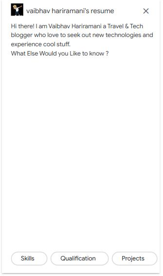
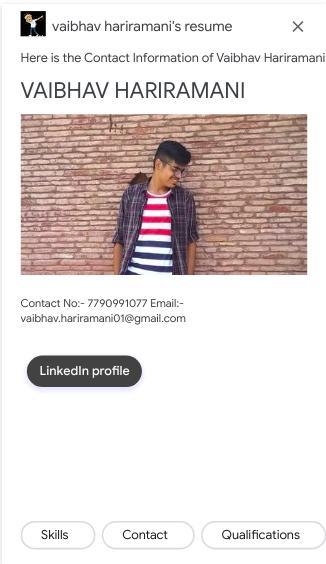
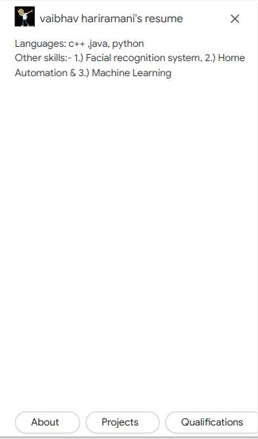
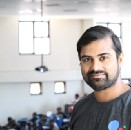

# OK-Google-Virtual-Resume-on-Google Assistant 

## Create your own Action on Google Assistant by this repo as template

### Checkout my published Action on Google Assistant [here](https://assistant.google.com/services/a/uid/000000bf983491f0?hl=en-US&source=web) :

 Virtual Resume Template "OK-Google-Virtual-Resume-on-Google Assistant" help you to develop a #DigitalResume with #GoogleAssistant Resume.

###   

# All Credits goes to :

<table>
    <tr>       
      <td align="center"><a href="https://www.linkedin.com/in/sharmaayush981/"> <b>Ayush Sharma</b>  Maintainer</a></td>
      <td align="center"><a href="https://github.com/sharmaaayu981"> <b>Ayush Sharma</b>  Contributor</a></td>
      <td align="center"><a href="https://www.linkedin.com/in/kamal-vaid/">  <b>Kamal vaid</b> Contributor</a></td>
      <td align="center"><a href="https://www.linkedin.com/in/vaibhav-hariramani-087488186/"> <b>Vaibhav Hariramani</b>  ML enthusiast</a></td>  
      </tr>
</table>

## Create your `Digital Resume` within 20-30 minutes through the `**Digital Interactive virtual resume template**`
===

Your resume would also work live on Google Assistant. Make your resume more interesting and interactive, just, download the project and start working on it by following the steps given in the tutorial video here: [Youtube](https://www.youtube.com/playlist?list=PLj1rwJ0GTMiUYQLytSMpC_Cl5uWl1InVU)

## My DIgital CV
My Digital CV is Interactive Virtual Resume Template which provides basic functionality to develop your own Digital Resume/CV, Which works on Google Assistant and accessible on various supported platforms. You can develop your interactive Digital CV within 20-30 Minutes by using this Dialogflow template. 
### Features 
Easy to use the [template](https://github.com/vaibhavhariaramani/OK-Google-Virtual-Resume-on-Google-Assistant/tree/master/Template) to make a Digital resume that works on Google Assistant.

### Developing Your Digital CV
- Sign-in with Dialogflow and import [Template](https://github.com/vaibhavhariaramani/-My-Digital-CV/tree/master/Template).
- Set Up  Dialogflow Agent
- Link Dialogflow Agent with Google Assistant.
- Download the [Privacy Policy Document](https://github.com/sharmaaayu981/My-Digital-CV/tree/master/Privacy%20Policy) and change it according to your Assistant and upload it on Google Drive and make it public.
- Set up Google Assistant Project
- Deploy Project for Review
- Test on your Device also ( Google Assistant , by using same Email on the Google Assistant)

### Key Points
1. Setup your DialogFlow Agent by using the [Template](https://github.com/vaibhavhariaramani/-My-Digital-CV/tree/master/Template).
2. Setup Google Assistant Setup.
3. Deploy the project for Review.

### Bonus Point
- [Video Tutorials](https://www.youtube.com/playlist?list=PLj1rwJ0GTMiUYQLytSMpC_Cl5uWl1InVU) and [Document Tutorials](https://github.com/vaibhavhariaramani/-My-Digital-CV/tree/master/Document%20Tutorials) are available, follow the document step-by-step and make your digital CV better.
- Please see [Sample](https://assistant.google.com/services/a/uid/000000ec94ce6de1?hl=en)
 app for full example. 
 - Disable "Small Talk" if you get any error regarding "MIC POLICY".

### Contributing
Please raise an issue of the requirement or problem in deploy the project so that a discussion can take before any step, even if you intend to raise a pull request.

Please see the Tutorial/Setup [Document Tutorials](https://github.com/vaibhavhariaramani/-My-Digital-CV/tree/master/Document%20Tutorials) or [Video Tutorials](https://github.com/vaibhavhariaramani/-My-Digital-CV/tree/master/Video%20Tutorial) for full references.

### Made with ❤️by Vaibhav Hariramani
#### About me

I am an Actions on Google, Internet of things, Alexa Skills, and Image processing developer.
I have a keen interest in Image processing and Andriod development.
I am Currently studying at  Chandigarh University, Punjab.

You can find me at:-
[Linkedin](https://www.linkedin.com/in/vaibhav-hariramani-087488186/) or [Github](https://github.com/vaibhavhariaramani) .

Happy coding ❤️ .

### Contact Us
* [LinkedIn](https://www.linkedin.com/in/vaibhav-hariramani-087488186/) 
* [Email](vaibhav.hariramani01@gmail.com)
* [Twitter](https://twitter.com/vaibhavhariram2)

